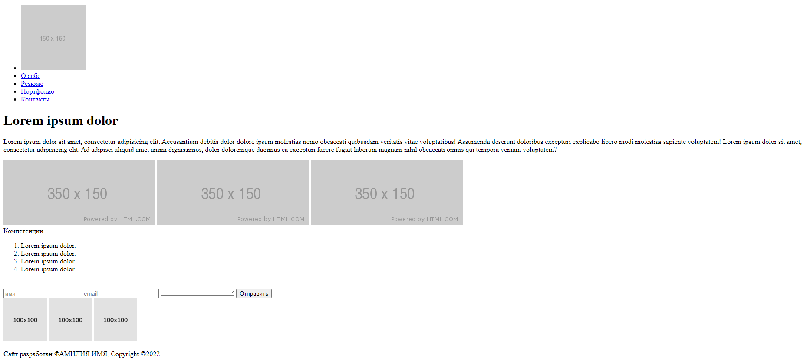

# Семинар 1: Знакомство с HTML, GIT.

## HTML

HTML (HyperText Markup Language) — стандартизированный
язык гипертекстовой разметки документов

**Язык HTML не является языком программирования, он служит только для описания структуры документа!!!**

### HTML теги
Структура документа в языке HTML описывается при помощи специальных тегов. С полным списков тегов и их 
назначением можно ознакомиться [здесь](https://html5book.ru/html-tags/)

Необязательно запоминать все теги, потому что многие из них используются крайне редко, для начала хватит 
следующих основных тегов:
1. Заголовки: \<h1>, \<h2>, ..., \<h6> (заголовки различного уровня (чем больше цифра, тем меньше размер
шрифта по умолчанию))
2. Текст: \
 (параграфы в тексте)
3. Списки: \<ul> (не нумерованный список), \<ol> (нумерованный список)
4. Ссылки: \<a> (гипертекстовые ссылки)
5. Изображения: \ (встраивает изображения в HTML-документ)
6. Блоки: \
  (контейнер для разделов HTML-документа)
7. Таблицы: \<table> (создание таблицы)
8. Формы: \<form> (форма для сбора и отправки на сервер информации от пользователей)

### Базовая структура HTML-документа

Любой HTML-документ обязан содержать минимальный набор тегов для корректной работы в браузере.
Подробно можно почитать [здесь](https://ru.hexlet.io/courses/layout-designer-basics/lessons/page-structure/theory_unit)

    <!doctype html>
    <html lang="ru">
        <head>
            <meta charset="UTF-8">
            <title>Document</title>
        </head>
        <body></body>
    </html>

Для исключения рутинной работы можно использовать сниппеты (фрагмент исходного кода программы, который можно
автоматически вставить в документ короткой командой). Например, в редакторе `VS Code` в пустом файле с расширением
`.html` можно ввести восклицательный знак `!` и нажать на `tab` на клавиатуре, чтобы заполнить пустой документ
следующим образом:

    <!DOCTYPE html>
    <html lang="en">
    <head>
        <meta charset="UTF-8">
        <meta http-equiv="X-UA-Compatible" content="IE=edge">
        <meta name="viewport" content="width=device-width, initial-scale=1.0">
        <title>Document</title>
    </head>
    <body>
    </body>
    </html>

Если кто-нибудь заинтересуется в разработке собственных снипетов для `VS Code`, 
[здесь](https://v3c.ru/soft/snippet-vscode) можно ознакомиться с инструкцией

### Семантическая верстка

[Прочитайте это](https://www.w3schools.com/html/html5_semantic_elements.asp)

### Создание первого документа

В качестве разминочного задания создайте небольшой html документ вроде этого

## GIT
`Git` - система управления версиями программного кода, позволяющая отслеживать историю изменения исходного
кода программы в ходе разработки.

### Базовые команды

* `git clone` - клонировать репозиторий в текущую папку
* `git init` - инициализирует новый git репозиторий в текущей папке
* `git add .` - необходимо находиться в папке с репозиторием, индексирует измененные файлы и добавляет их к 
 следующему коммиту (вместо "." можно указывать название конкретного файла, чтобы добавить только его, `git add .`
добавляет к следующему коммиту все обновленные файлы)
* `git commit -m "Commit message"` - утвердить сделанные изменения, сохранить их локально с
  указанным сообщение ("Commit message") (после этой операции commit не отправляется на сайт)
* `git push` - отправить все commit в удалённый репозиторий (commit появится на сайте)
* `git fetch` - проверить наличие новых коммитов
* `git pull` - принять все новые коммиты

### Публикация сайта на хостинге GitHub

GitHub предоставляет возможность бесплатно публиковать ваши статичные сайты (состоящие только
из .html, .js, .css файлов, т.е. не использующих back-end)

Для того чтобы опубликовать свой сайт необходимо проделать следующие шаги:
1. Загружаем исходный код в репозиторий
2. В настройках (вкладка `Settings`) открываем раздел `Pages`. В нем выбираем `Branch` - `master`, сохраняем настройки.

3. Ждем (процесс публикации сайта обычно занимает от 1 до 5 минут), периодические обновляя страницу
4. Когда сайт опубликуется вы уведите ссылку на сайт
   

**Это и следующие задания будут считаться выполненными только в случае размещения их
исходного кода в GitHub репозитории с публикацией сайта на хостинге**

## Задание на первый семинар

1. Воспроизвести документ из раздела `HTML. Создание первого документа` используя семантическую верстку
2. Зарегистрировать в системе контроля версий [GitHub](https://github.com/).
3. Создать репозиторий для первого задания.
4. Загрузить html документ в репозиторий.
5. Опубликовать сайт на хостинге `GitHub`

